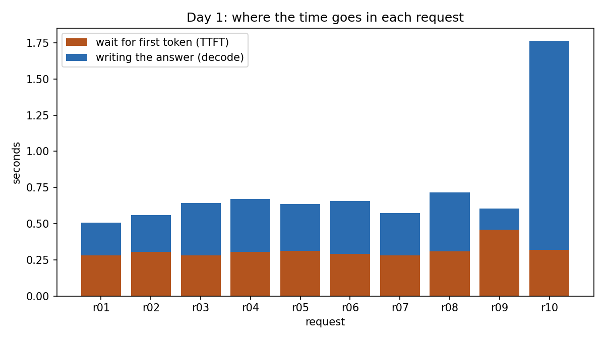
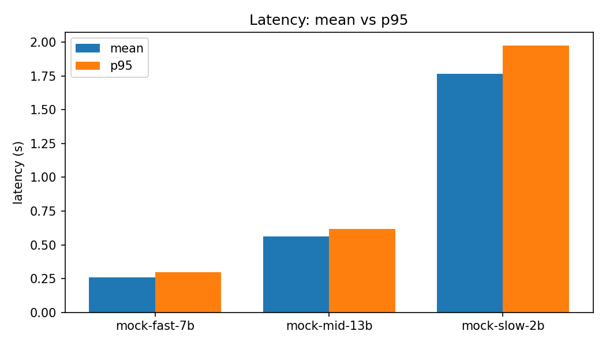
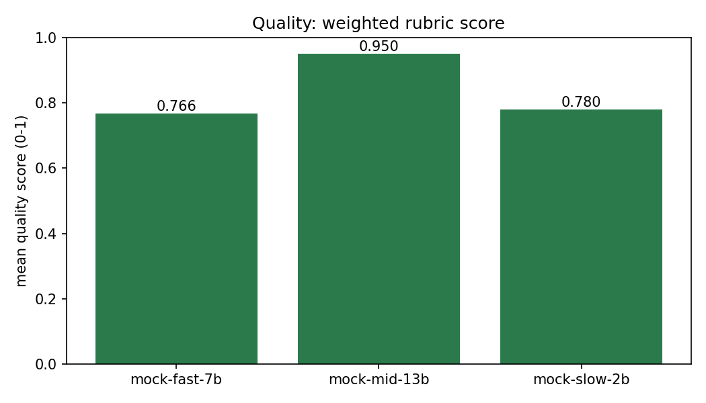
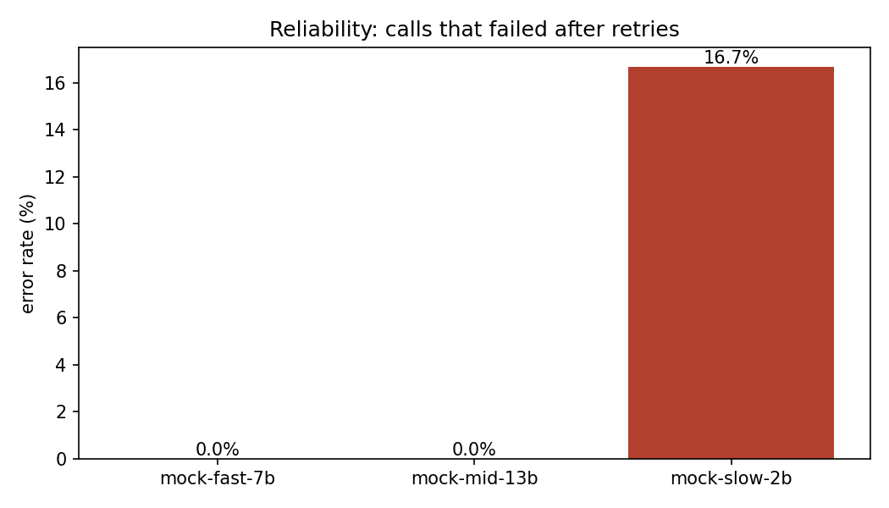
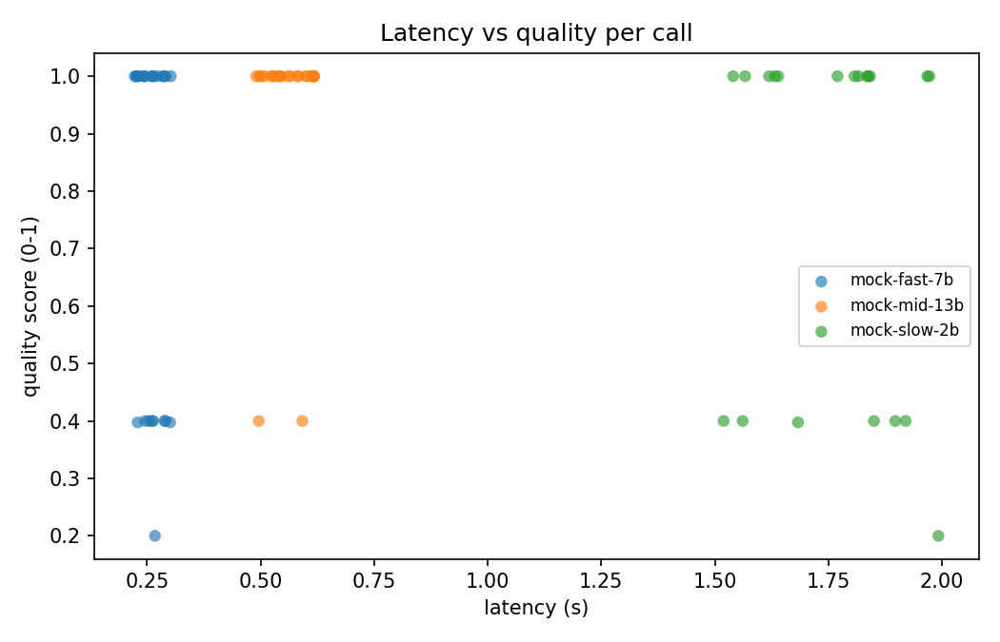

# evalharness

A small, reproducible evaluation harness for comparing hosted LLM APIs.

Point it at two or more OpenAI-compatible endpoints (OpenAI, Groq, Together,
OpenRouter, a local vLLM or Ollama server), give it a prompt set and a scoring
rubric, and it produces structured logs, per-model latency and reliability
stats, quality scores, and comparison charts. Built for the kind of
model-comparison work where you need to show your reasoning, not just a vibe:
same prompts, same parameters, same timing method, every result traceable to
the exact config that produced it.

A bundled synthetic demo runs the whole pipeline with mock providers. No API
keys, no network, no cost.

## Quickstart

```bash
git clone https://github.com/hmg65/evalharness.git
cd evalharness
pip install -r requirements.txt

python -m evalharness demo     # synthetic end-to-end run, no keys needed
python -m evalharness lab      # guided Day 1 inference lab, no keys needed
python -m pytest -q            # 25 tests
```

The demo compares three fake models with different personalities (fast but
sloppy, slower but careful, slow and flaky) and writes logs, summaries, and
charts to `results/`.

## Learning inference? Start with the Day 1 lab

If you are here to learn how model endpoints behave under the hood, run:

```bash
python -m evalharness lab
```

It sends ten requests, one at a time, to a simulated streaming endpoint and
explains every number in plain language: prompt tokens, output tokens, time
to first token (TTFT), time per output token (TPOT), throughput, latency,
and errors. No keys, no cost, no jargon assumed. Then open
[docs/lab/day1.md](docs/lab/day1.md): a short worksheet with five questions
to answer from your own output, and the smallest honest next step to a real
endpoint when you are ready.

Sample output (committed in [docs/lab/](docs/lab/)):

| Req | Prompt tokens | Output tokens | First token (s) | Per token (ms) | Total (s) | Tokens/sec |
|---|---|---|---|---|---|---|
| r01 | 14 | 13 | 0.282 | 19 | 0.507 | 53 |
| r09 | 128 | 8 | 0.457 | 21 | 0.605 | 47 |
| r10 | 22 | 80 | 0.318 | 18 | 1.763 | 55 |



## Demo output

| Model | Calls | Errors | Error rate | Mean lat (s) | p95 | Quality |
|---|---|---|---|---|---|---|
| mock-fast-7b | 24 | 0 | 0.0% | 0.261 | 0.299 | 0.766 |
| mock-mid-13b | 24 | 0 | 0.0% | 0.562 | 0.617 | 0.950 |
| mock-slow-2b | 24 | 4 | 16.7% | 1.764 | 1.973 | 0.780 |

The story the harness is built to tell: the mid-size model is 2x slower than
the fast one but clearly better quality, and the cheap one is not cheap once
you count the retries.

| Latency | Quality | Reliability | Latency vs quality |
|---|---|---|---|
|  |  |  |  |

## Comparing real models

Copy `configs/openai_compat.example.yaml`, name your endpoints, and export
the keys it references:

```yaml
models:
  - name: gpt-4o-mini
    provider: openai_compat
    model_id: gpt-4o-mini
    base_url: https://api.openai.com/v1
    api_key_env: OPENAI_API_KEY        # read from the environment, never from this file
    params: {temperature: 0.0, max_tokens: 256, seed: 42}

  - name: local-vllm
    provider: openai_compat
    model_id: Qwen/Qwen2.5-7B-Instruct
    base_url: http://localhost:8000/v1
    api_key_env: LOCAL_API_KEY
    params: {temperature: 0.0, max_tokens: 256, seed: 42}
```

```bash
export OPENAI_API_KEY=sk-...
python -m evalharness run --config configs/my_run.yaml
```

Any string of the form `${VAR}` in a config is expanded from the environment,
so base URLs can be parameterized too. See `.env.example`.

Prompt sets are JSONL, one `{"id", "prompt", "reference"}` object per line.
`reference` is optional; scorers that need it skip or fail gracefully without
it. Bring your own task prompts: the bundled `data/prompts/synthetic_qa.jsonl`
is synthetic and only exists for the demo.

## What gets measured

Every call goes through one path: bounded concurrency, per-call timeout,
exponential-backoff retries, scoring, then one JSONL row. Each row records
the prompt, model, sampling params, status, error, attempt count, latency,
token counts, quality score with per-scorer reasons, and a hash of the full
run config, so a results file proves which setup produced it.

- **Latency**: mean, median, p95, p99, min, max per model, measured
  wall-clock by the harness so every provider is timed identically.
- **Reliability**: error rate after retries, total retry count.
- **Quality**: weighted mean over pluggable scorers, with a per-call reason
  string for every score. You can always answer "why did this model lose".

## Scorers

Declared in the run config and combined as a weighted mean:

```yaml
scorers:
  - type: contains      # 1.0 when the reference substring(s) appear, weight 3
    weight: 3.0
  - type: not_refusal   # 0 when the answer refuses or hedges
    weight: 1.0
  - type: length        # how close the answer is to a target word band
    min_words: 3
    max_words: 80
    weight: 1.0
  # - type: regex
  #   pattern: "O\\(1\\)"
```

Custom scorers implement one method, `score(prompt, reference, text) ->
(value in [0,1], reason)`. `examples/judge.py` shows an LLM-as-judge scorer
that grades answers through the same provider layer (same retries and
timeouts) as the models under test.

## Reproducibility rules the harness enforces

- Sampling params live in the config and are logged on every row. Fix
  temperature and seed across models or the comparison is noise.
- `samples_per_prompt` repeats each prompt so latency stats mean something.
- A config fingerprint is stamped on every result row.
- The mock providers are fully seeded: rerun the demo and you get the same
  numbers.

## Layout

```
evalharness/
  config.py            YAML config -> validated dataclasses, ${ENV} expansion
  providers/
    base.py            ModelClient protocol + ModelResponse
    openai_compat.py   any OpenAI-compatible chat endpoint (httpx)
    mock.py            deterministic fake models for demo/tests
  runner.py            concurrency, timeouts, retries, JSONL logging
  lab.py               guided Day 1 lab: streaming metrics, plain-language report
  scoring.py           pluggable rubric scorers
  metrics.py           latency/reliability statistics
  report.py            summary JSON/CSV/Markdown
  charts.py            comparison charts (matplotlib)
  cli.py               run / report / demo
configs/               demo + real-endpoint template
data/prompts/          synthetic demo prompt set
examples/              demo script, LLM-judge scorer example
tests/                 pytest suite
docs/demo/             committed demo output (what you see above)
docs/lab/              Day 1 worksheet + committed lab output
```

## Notes

- Secrets only ever come from the environment. Configs, logs, and git history
  never contain a key.
- The runner treats provider errors as data: a flaky model shows up as error
  rate and retries, not a crashed run.
- `python -m evalharness report --results results/demo.results.jsonl`
  rebuilds summaries and charts from an existing log without re-calling any
  model.

MIT licensed.
